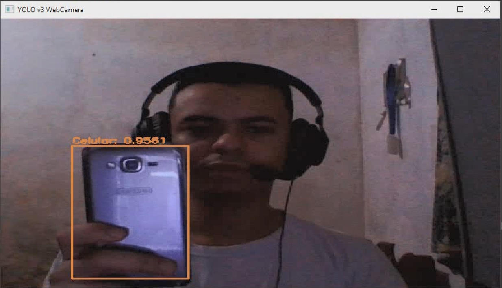

# Assistência à Mobilidade para Deficientes Visuais

Este projeto foi criado por José Filipe, com menoria dos professores Josenildo Costa da Silva, João Oliveira,... em colaboração com a Softex e o IFMA - Instituto Federal do Maranhão. Ele faz parte de uma residência em Inteligência Artificial e tem como objetivo fornecer assistência à mobilidade de deficientes visuais em suas residências, utilizando inteligência artificial para detectar objetos em tempo real e anunciar o nome dos objetos detectados por meio de síntese de fala.

## Sumário

1. [**Introdução**](#introdução)
2. [**Requisitos**](#requisitos)
3. [**Configuração**](#configuração)
4. [**Executando o Projeto**](#executando-o-projeto)
5. [**Funcionamento do Código**](#funcionamento-do-código)
   - [**Detecção de Objetos**](#detecção-de-objetos)
   - [**Síntese de Fala**](#síntese-de-fala)
   - [**Registro de Resultados**](#registro-de-resultados)
6. [**Perspectiva Futura**](#perspectiva-futura)

## Introdução

A falta de visão é uma das limitações mais desafiadoras que uma pessoa pode enfrentar em sua vida diária. Para os deficientes visuais, tarefas simples, como navegar em suas próprias casas, podem ser um desafio constante. Este projeto visa trazer uma solução para esse desafio.

O projeto foi criado com a motivação de melhorar a qualidade de vida dos deficientes visuais, proporcionando-lhes uma maior autonomia em suas casas. Através da detecção de objetos em tempo real, o sistema é capaz de identificar e anunciar os objetos presentes no ambiente, permitindo que os deficientes visuais tenham uma compreensão mais precisa de sua localização e dos objetos ao seu redor.

## Requisitos

Antes de usar a aplicação, certifique-se de que você possui os seguintes requisitos:

- Python
  - Você pode baixar o Python em [python.org](https://www.python.org/downloads/) e seguir as instruções de instalação apropriadas para o seu sistema operacional.

- OpenCV
  - Você pode instalar o OpenCV usando o comando `pip install opencv-python`.

- pyttsx3
  - Instale o pyttsx3 usando o comando `pip install pyttsx3`.

- O aplicativo IP Webcam (para usar a câmera do dispositivo Android como fonte de vídeo).
  - Baixe o aplicativo IP Webcam na loja de aplicativos do seu dispositivo Android.

- O modelo YOLOv4-tiny pré-treinado
  - Certifique-se de que o modelo YOLOv4-tiny está disponível no repositório do projeto, conforme as configurações apropriadas.

- Um arquivo `yolo.nomes` contendo os nomes dos objetos que o modelo foi treinado para detectar.
  - Crie um arquivo `yolo.nomes` com os nomes dos objetos e coloque-o no diretório `yoloDados/`.

## Configuração

Este projeto já inclui a pasta `yoloDados` com as configurações necessárias, incluindo os arquivos `yolov4-tiny.cfg`, `yolov4-tiny.weights`, e `yolo.nomes`.

Antes de executar o código, verifique se os seguintes arquivos estão presentes no diretório `yoloDados/`:

- `yolov4-tiny.cfg` (Configuração do modelo YOLOv4-tiny)
- `yolov4-tiny.weights` (Pesos do modelo YOLOv4-tiny)
- `yolo.nomes` (Arquivo com os nomes dos objetos que o modelo foi treinado para detectar)

Além disso, verifique a configuração da variável `url` no código para garantir que esteja definida corretamente para a fonte de vídeo desejada. Para usar a câmera nativa do computador, configure a variável `url` como 0.

Para executar o projeto, basta clonar o repositório, garantir que os arquivos estejam presentes e configurar a variável `url` conforme a sua fonte de vídeo.

## Executando o Projeto

Para usar a aplicação, siga estas etapas:

1. Execute o código fornecido, garantindo que a variável `url` esteja configurada corretamente. Para usar a câmera nativa do computador, defina `url` como 0.

2. O código iniciará a captura de vídeo e realizará a detecção de objetos em tempo real.

3. Para interromper a execução do projeto, pressione 'q' na janela da câmera.

## Funcionamento do Código

### Detecção de Objetos

A detecção de objetos é realizada utilizando o framework YOLO (You Only Look Once) com o modelo YOLOv4-tiny. O código processa cada quadro do vídeo, pré-processando-o e passando-o pelo modelo. Os objetos detectados são comparados com os rótulos definidos no arquivo `yolo.nomes`. O código exibe as caixas delimitadoras dos objetos detectados e seus rótulos no vídeo.

### Síntese de Fala

Quando um objeto é detectado, o código utiliza a biblioteca `pyttsx3` para sintetizar a fala e anunciar o nome do objeto ao usuário por meio de áudio. O texto a ser sintetizado é obtido dos rótulos dos objetos detectados.

### Registro de Resultados

Os resultados da detecção são registrados em um arquivo CSV chamado `teste.csv`. Cada vez que um objeto é detectado, os rótulos dos objetos e suas acurácias são registrados no arquivo. Isso permite rastrear os objetos detectados e suas respectivas confianças ao longo do tempo.

## Perspectiva Futura

Estamos focados em aprimorar e expandir a aplicação no futuro. Uma das nossas metas é melhorar continuamente o desempenho e a eficiência do código, aprimorando algoritmos de detecção e adotando práticas de programação mais eficazes. Queremos tornar os resultados mais informativos, buscando incluir informações contextuais, como relatórios detalhados, para proporcionar aos deficientes visuais uma compreensão mais completa do ambiente e melhorar a análise do resultado.

Consideramos explorar o ecossistema do Darknet YOLO para insights valiosos e testar outras versões e modelos de dataset, visando aprimorar a detecção de objetos, pelo [repositório oficial do Darknet](https://github.com/AlexeyAB/darknet). A criação de um dataset personalizado com objetos relevantes para a mobilidade dos deficientes visuais é uma estratégia que pode melhorar significativamente a precisão da detecção.

Além disso, buscamos aprimorar a interface gráfica, visando oferecer uma experiência mais intuitiva aos usuários, com opções mais claras e feedback visual mais informativo. Olhando para o futuro, estamos explorando o desenvolvimento de óculos inteligentes para deficientes visuais. A ideia é integrar componentes como ESP-Cam e sensores ultrassônicos, aproveitando a experiência adquirida até o momento para criar um protótipo funcional e eficaz.

